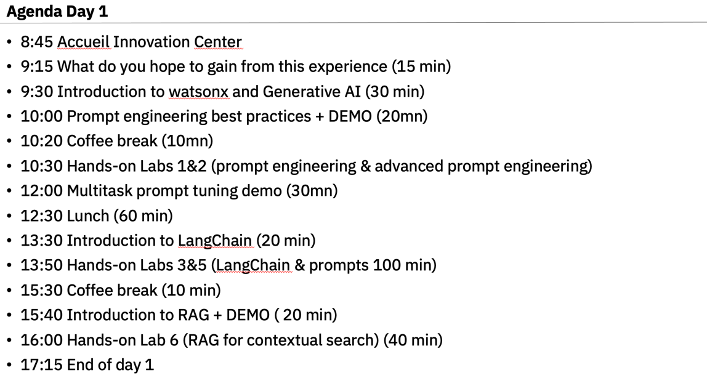
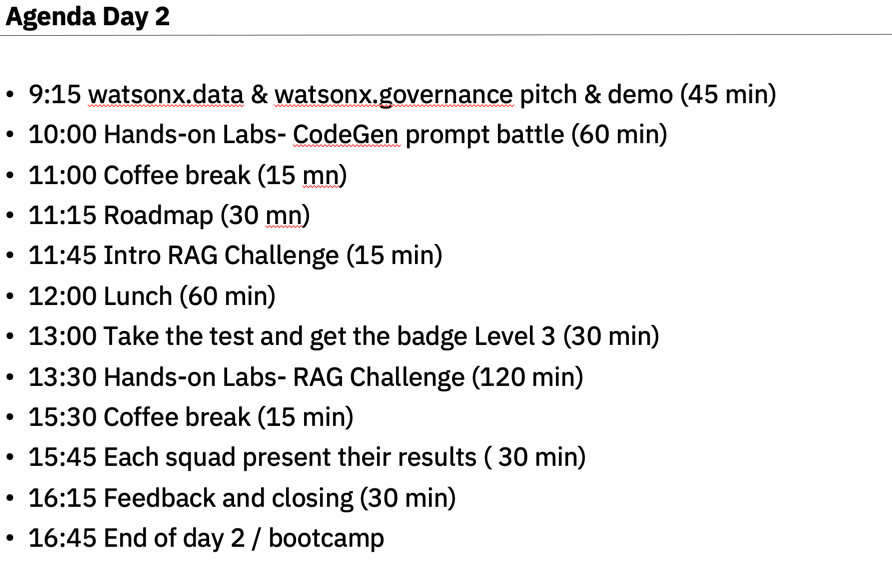

# Watsonx Bootcamp EMEA: Foundations of watsonx.ai 

## Agenda

### Day 1:

### Day 2:

### Hands-on LABs Level 1
| **Time**        | **Topic**                                                                                                                             |
|-----------------|---------------------------------------------------------------------------------------------------------------------------------------|
| 30 mins  | Lab 0: [Setup Your Laptop Environment](./self-guided-labs/level-1/lab-0-laptop-environment-setup)                                     |  
| 90 mins  | Lab 1: [Intro Prompt Engineering Using watsonx.ai Prompt Builder](./self-guided-labs/level-1/lab-01-intro-to-prompt-engineering)      |  
| 90 mins  | Lab 2: [Advanced Prompt Engineering Challenge](./self-guided-labs/level-1/lab-02-advanced-prompt-engineering)                         |  
| 60 mins  | Lab 3: [Langchain Prompt Templates](./self-guided-labs/level-1/lab-03-langchain-prompt-template)                                      | 
| 60 mins  | Lab 5: [watsonx.ai and Langchain](./self-guided-labs/level-1/lab-05-watsonxai-and-langchain)                                          | 
| 60 mins  | Lab 6: [Retrieval Augmented Generation (RAG) for Contextual Search](./self-guided-labs/level-1/lab-06-retrieval-agumented-generation) |
| 30 mins  | Lab 7: [Code generation Battle ](./self-guided-labs/level-1/lab-09-prompt-battle-code-gen)                                            | 

### Hands-on LABs Level 2 (*optional)
| **Time**        | **Topic** |
|-----------------|-------------------|
| 30 mins  | Lab 10: [Milvus Vector Datbase Lab](./self-guided-labs/level-2/lab-10-vector-db) |
| 30 mins  | Lab 11: [Prompt Tuning for Classification Lab](./self-guided-labs/level-2/lab-11-advanced-prompt-tuning) |

### What Is Watsonx.ai
| **Time**        | **Topic** |
|-----------------|-------------------|
| 20 mins  | [Technical POV on watsonx.ai Platform](watsonxai-platform.md) | 
| 10 mins  | [IBM's Foundation Models](images/ibm-foundation-models.md) | 

### Apply Lessons Learned (CHOOSE ONE...OR MORE)
You've made it to the end.  Almost. You will now apply the new skills that you've learned to the challenges below.  Select one of the challenges below and be creative.  These challenges are specifically open-ended.  Combine your own unique skills to extend the use case solutions provided in these challenges.    

| **Time**        | **Topic** |
|-----------------|-------------------|
| 1  hour   | Challenge 1: [Text Classification of News Articles](./self-guided-labs/apply-lessons-learned/challenge-01) | 
| 2  hours  | Challenge 2* optional: [Multi-Turn Model Interactions](./self-guided-labs/apply-lessons-learned/challenge-02) | 

### NOTE:
- Completing these technical hands-on labs will take roughly 12 hours plus another 2-3 hours to complete the Apply Lessons Learned labs. You should have completed the [attendee pre-requisites](attendee-prerequisites.md) prior to starting. 
- Did you complete another Challenge listed and want to share your results.  Send your Github repo link to [Mehdi Boulaymen ](mailto:mehdi.boulaymen@ibm.com)  and we'll add it to this list.    

